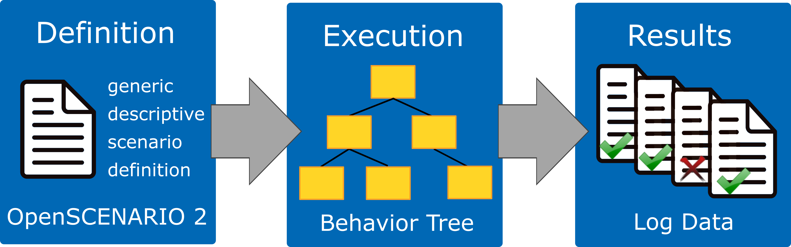
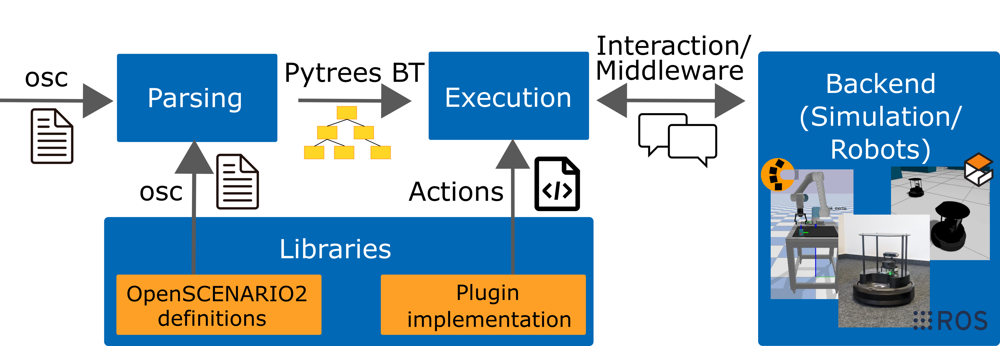
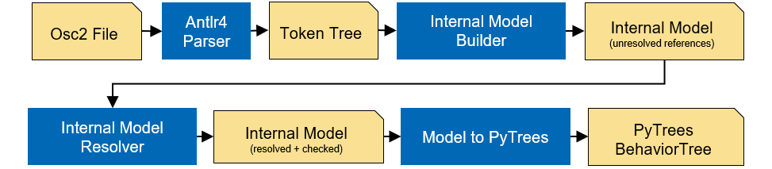

Architecture
============

   Overview of Scenario Execution

Scenario execution is built as a Python library on top of two open-source components: the generic scenario description language `OpenSCENARIO DSL <https://publications.pages.asam.net/standards/ASAM_OpenSCENARIO/ASAM_OpenSCENARIO_DSL/v2.2.0/index.html>`_ and `PyTrees  <https://py-trees.readthedocs.io/en/devel/introduction.html>`_.
In general, the user defines a scenario in the OpenSCENARIO DSL language, scenario execution parses the scenario, translates it to a behavior tree, executes it and finally gathers the test results.

   Architecture of Scenario Execution

Our implementation is highly modular separating the core components from simulation- and/or middleware-specific modules realized through a plugin-based approach. 
In principle, any additional feature that is required by a specific scenario and that can be implemented in Python could be realized as additional library.
A library typically provides an OpenSCENARIO DSL file with additional definitions and may provide code implementing additional functionality such as conditions or actions.

Currently, the following sub-packages and libraries are available:

-  :repo_link:`scenario_execution`
-  :repo_link:`scenario_execution_ros`
-  :repo_link:`scenario_execution_gazebo`
-  :repo_link:`scenario_execution_control`
-  :repo_link:`scenario_execution_interfaces`
-  :repo_link:`scenario_execution_rviz`

Design for Modularity
---------------------

Scenario execution is designed to be easily extensible through libraries.
An example is available here: :ref:`scenario_library`.

The entry points are defined like this:

.. code-block::

  entry_points={
   'scenario_execution.actions': [
       'custom_action = example_library.custom_action:CustomAction',
   ],
    'scenario_execution.osc_libraries': [
        'example = example_library.get_osc_library:get_example_library',
    ]
  }

Scenario Parsing
----------------

   Architecture of Scenario Parsing

The Internal Model Builder, implemented as a Model Listener does an initial check of the model by checking for supported language features. The Internal Model Resolver, implemented as a Model Visitor is used for type/variable resolving and does an in depth consistency check of the model.

Modules
-------

- ``scenario_execution``: The base package for scenario execution. It provides the parsing of OpenSCENARIO DSL files and the conversion to py-trees. It's middleware agnostic and can therefore be used as a basis for more specific implementations (e.g. ROS or step-based simulation). It also provides basic OpenSCENARIO DSL libraries and actions.
- ``scenario_execution_ros``: This package uses ``scenario_execution`` as a basis and implements a ROS2 version of scenario execution. It provides a OpenSCENARIO DSL library with basic ROS2-related actions like publishing on a topic or calling a service.
- ``scenario_execution_control``: Provides code to control scenario execution (in ROS2) from another application such as RViz.
- ``scenario_execution_coverage``: Provides tools to generate concrete scenarios from abstract OpenSCENARIO DSL scenario definition and execute them.
- ``scenario_execution_gazebo``: Provides a `Gazebo <https://gazebosim.org/>`_-specific OpenSCENARIO DSL library with actions.
- ``scenario_execution_interfaces``: Provides ROS2 `interfaces <https://docs.ros.org/en/rolling/Concepts/Basic/About-Interfaces.html>`__, more specifically, messages and services, which are used to interface ROS2 with the ``scenario_execution_control`` package.
- ``scenario_execution_rviz``: Contains several `rviz <https://github.com/ros2/rviz>`__ plugins for visualizing and controlling scenarios when working with ROS2.
- ``simulation/gazebo_tf_publisher``: Publish ground truth transforms from simulation within TF.
- ``simulation/tb4_sim_scenario``: Run `Turtlebot4 <https://turtlebot.github.io/turtlebot4-user-manual/software/turtlebot4_simulator.html>`_ within simulation, controlled by scenario execution.
- ``tools/message_modification``: ROS2 nodes to modify messages.
- ``tools/scenario_status``: Publish the current scenario status on a topic (e.g. to be capture within a ROS bag).

Action Lifecycle
----------------

Every action is a py-trees behavior (``BaseAction``), so the tree owns when it runs, when it stops,
and what it is allowed to assume in between.

**A tick is shared.** ``update()`` is called once per tick for every action currently running, in
every branch, on one thread. Blocking there stalls the whole scenario, so a long operation is
started and then polled across ticks rather than waited for. Actions that must clean up
asynchronously hand a future to ``ShutdownHandler`` instead of blocking on it.

**Stopping is not the same as finishing.** py-trees calls ``terminate(new_status)`` when a behavior
stops, and ``INVALID`` means the branch was abandoned rather than completed -- a losing ``one_of``
child, or one the ``timeout`` modifier gave up on. An action whose effect outlives the tick, such as
a goal a robot is still driving or a process still running, has to end that effect there; otherwise
the branch ends while the effect continues to the end of the scenario. ``BaseAction.terminate()``
does this centrally by calling ``request_cancel()``, which an action overrides to stop whatever it
started, and which reports ``False`` when it cannot.

**Actions do not reference each other.** There is no way for one action to reach another and act on
it, by name or otherwise. Coordination between branches goes through the blackboard, which at the
DSL surface is ``event`` / ``emit`` / ``wait @``: one branch decides when to signal, another decides
what the signal ends, and neither depends on the other's structure or on the order the branches were
written in. This is what keeps composition predictable -- an action's behavior follows from its own
subtree, not from what a sibling elsewhere chose to do to it.

Step-based Simulation
---------------------

``scenario_execution`` supports step-based simulators (e.g. MuJoCo, PyBullet, custom hardware-in-the-loop setups) through the :class:`SimulationInterface <scenario_execution.SimulationInterface>` abstraction. This allows scenario authors to run scenarios while retaining full use of the OpenSCENARIO DSL, including time-based directives such as ``wait elapsed()`` and ``timeout()``.

**Clock abstraction**

In normal (wall-clock) mode the framework uses ``time.sleep()`` between ticks. In step-based mode there is no sleeping: the loop runs as fast as the simulator allows. Time is tracked by a :class:`SimulationClock <scenario_execution.SimulationClock>` that advances by exactly ``dt`` seconds per tick, so ``wait elapsed(1s)`` maps to exactly ``1 / dt`` simulation steps regardless of the system clock.

The :class:`WallClock <scenario_execution.WallClock>` is used as fallback when no simulation is configured, preserving backward compatibility.

.. code-block::

   ┌─────────────────────────────────────────────────────┐
   │                  ScenarioExecution                  │
   │                                                     │
   │  run_with_simulation(sim)                           │
   │    sim.setup()                                      │
   │    sim.reset()        ← once before the scenario    │
   │    while running:                                   │
   │      sim.step()       ← advance the simulator       │
   │      clock.advance()  ← advance SimulationClock     │
   │      tree.tick()      ← advance the behavior tree   │
   │    sim.shutdown()                                   │
   └─────────────────────────────────────────────────────┘

**Who owns the loop: base runner vs. ROS runner**

The loop above belongs to the base runner, where the simulation drives everything and there is no
``rclpy`` — which also means no ROS behavior can run in it. The ROS runner cannot adopt that shape,
because the executor owns its loop. ``ROSScenarioExecution`` therefore steps the simulation *from
inside* the spin loop instead, so the simulation advances alongside the ROS behaviors that drive it
and a scenario can bring up a ROS stack against a step-based simulator. Stepping is paced to real
time; a simulation that publishes ``/clock`` on ``step()`` becomes the time source for every node,
including this one.

.. _ros_simulated_time:

**ROS simulated time**

Under ``use_sim_time`` the scenario execution node's clock is ``/clock``, and with it two things at
once: ``RosClock`` -- the scenario clock every ``wait elapsed()``, ``timeout()`` and
``action_call(cancel_after:)`` reads -- and the ``rclpy`` timer ``py_trees_ros`` ticks the tree with,
because ``Node.create_timer`` takes the node's clock by default. The tree therefore ticks in
simulated time and counts simulated seconds, and the same scenario produces the same ticks at the
same points whatever the host was doing. It is off by default; ``scenario_launch.py`` takes it as a
launch argument.

The framework names two time domains and hands a clock for each to every behavior's ``setup()``:

.. list-table::
   :widths: 15 20 65
   :header-rows: 1
   :class: tight-table

   * - Domain
     - Argument
     - What belongs to it
   * - scenario time
     - ``clock``
     - The durations a scenario states: ``wait``/``until elapsed()``, ``timeout()``,
       ``cancel_after``, an action's own measurement window. ``/clock`` under ``use_sim_time``,
       ``SimulationClock`` under ``--simulation``, the system clock otherwise.
   * - host time
     - ``host_clock``
     - What has to keep running when a simulated clock does not: the setup timeout, a process
       kill deadline, the teardown guard, clock liveness. Always monotonic.

The rule that assigns a duration to one of them: *if the simulator stopping should stop this timer,
it is scenario time; if the simulator stopping is what this timer exists to catch, it is host time.*
A host-time guard measured on a simulated clock can never expire, which is the one failure a guard
exists to catch. ``assert_realtime_factor()`` sits outside both by construction -- it subscribes
``/clock`` directly and compares it against ``time.monotonic()``, so its measurement does not depend
on how the node it runs in is configured.

Because the tree ticks on ``/clock``, a clock that never starts, stops, or is reset is the one
failure the tree cannot report about itself: it simply stops being ticked. ``ClockWatch`` holds that
state and the spin loop asks it. Before the first tick it waits for ``/clock`` to advance -- two
strictly increasing readings, since a single latched message from a dead publisher would otherwise
start the run against a frozen timeline -- and fails the scenario if it does not, rather than
falling back to host time and reporting a duration that was never measured. While the scenario runs
it fails on a stall and on a backwards jump, the latter being a simulation reset underneath a
running scenario. Both deadlines are host time, because what is being measured is the clock itself.

One consequence worth knowing before writing an action: the node's default callback group is
mutually exclusive, so the ``/clock`` callback and the tick callback serialize. A behavior that
*blocks inside* ``update()`` waiting for time to pass deadlocks under ``use_sim_time`` rather than
merely running slowly. py_trees forbids that anyway; here it stops being a matter of style.

The lifecycle differs accordingly. The base runner sets the simulation up and shuts it down once per
run, whereas the ROS runner does it **per scenario** — each scenario already runs on its own node and
executor, because ``py_trees_ros`` adopts the node it is given and destroys it on ``shutdown()``. A
simulation whose ``setup()`` or ``reset()`` raises fails that one scenario and lets the remaining
scenarios run, rather than aborting the file.

**API alignment with ros-simulation/simulation_interfaces**

The :class:`SimulationInterface <scenario_execution.SimulationInterface>` is conceptually aligned with the `ros-simulation/simulation_interfaces <https://github.com/ros-simulation/simulation_interfaces>`_ standard, making it straightforward to implement adapters for compliant simulators.

See :ref:`step_based_simulation` for usage instructions and a complete example.

.. _behavior_tree_status_log_internals:

Behavior Tree Status Log
------------------------

``--bt-log`` writes ``behaviors.jsonl``, described for users under :ref:`behavior_tree_status_log`. This section covers why it is built the way it is; ``scenario_execution/utils/bt_logger.py`` holds the implementation.

**One writer for both runners**

The writer lives in ``ScenarioExecution``, so ``ROSScenarioExecution`` inherits it rather than reimplementing it, and ``bt_logger.py`` imports nothing but the standard library and py_trees. Before this existed, behavior-tree state could only be captured through ``py_trees_ros``' snapshot stream, which meant recording a ROS topic — so ``mode: base`` scenarios had no way to record it at all, and everyone else paid for a rosbag to get it.

**A post-tick handler, not a visitor**

``add_post_tick_handler`` hands over the whole ``BehaviourTree``, so the writer walks ``root.iterate()`` — the same traversal ``py_trees_ros`` uses. A visitor only sees the nodes a tick actually traversed, which would miss a node *invalidated* out of the visited path and could not notice a subtree inserted or pruned at runtime. Walking every node each tick is O(nodes) and cheap at realistic tree sizes, so there is no ``changed`` gate to get subtly wrong.

A ``SnapshotVisitor`` is still attached, but only to fill ``is_active``: a node can hold ``SUCCESS`` from an earlier tick without being on the current path, so its status alone cannot answer whether this tick touched it.

**Content follows py_trees_ros, cadence does not**

The per-record fields mirror ``py_trees_ros_interfaces/Behaviour`` so a reader familiar with the ROS snapshots finds the same information. ``py_trees_ros`` republishes the *entire* tree on every snapshot, which is right for a transport whose subscribers may attach at any moment but would make a file grow by the tree size per tick. Instead the whole tree is written once at ``timestamp`` 0 and only status changes after that; the initial snapshot is what keeps never-executed branches in the file, so the tree can still be fully reconstructed.

Two of their fields are dropped and one is kept for a specific reason:

- ``child_ids`` is replaced by ``child_index``, one integer instead of a list of UUIDs per record. It is what restores sibling order, which ``parent_id`` alone does not give.
- ``current_child_id`` is dropped because ``tip_id`` already carries what it was needed for.
- ``tip_id`` is kept even though it looks derivable. Recomputing py_trees' ``tip()`` needs each composite's ``current_child``, which is not logged, and statuses alone do not determine it for a ``memory=True`` sequence or a parallel.

**Time source**

The writer takes a :class:`Clock <scenario_execution.Clock>` and calls ``now()``, so ``timestamp`` is simulated time whenever one exists and monotonic time otherwise — zero-based either way, with the metadata record naming which applied.

``ScenarioExecution.setup()`` resolves it as ``kwargs.get('clock')``. There is one scenario clock and the timers read the same one, so a duration a scenario states and a timestamp the run records are on the same timeline by construction rather than by agreement.

**Source locations**

Records carry ``osc_file``/``osc_line``/``osc_column`` so a behavior can be traced back to the scenario that declared it. Model elements have always known this (``ModelElement.set_ctx`` stores it from the ANTLR context, and ``ActionError`` reports it), but only plugin actions kept a reference to their model — composites, decorators and the built-in behaviors are plain py_trees objects. ``ModelToPyTree.BehaviorInit.stamp_source`` therefore stamps every behavior it creates with ``osc_source``.

For a modifier the stamp deliberately uses the *invocation* rather than the ``ModifierDeclaration``: built-in modifiers are declared in an imported library, so the declaration would point every ``timeout()`` in every scenario at the same line of ``helpers.osc``. The file is stored per behavior rather than once per run for the same reason — ``set_ctx`` records the file being parsed, so an imported ``.osc`` keeps its own name.

.. _tick_and_action_timing_internals:

Tick and Action Timing
----------------------

``--tick-log`` writes ``tick_timing.csv`` and ``action_timing.csv``, described for users under :ref:`tick_and_action_timing`. This section covers why it is built the way it is; ``scenario_execution/utils/tick_recorder.py`` holds the implementation and ``scenario_execution/tick_report.py`` reads the result back.

**Why not the behavior tree status log**

The status log already records *what* the tree did, so it is a fair question why timing is not simply added to it. Two reasons, and both are fatal to that idea. Its records are written only when a status changes, so a scenario sitting in one ``RUNNING`` action writes nothing at all — which is exactly the window a stall occupies. And its ``timestamp`` is simulated time whenever a clock exists, which is the one timeline on which a scheduling delay is invisible by construction.

The two features are therefore separate files and separate flags, either usable alone. They are made to fit together rather than to overlap: ``behavior_id``, ``behavior_name``, ``class_name`` and ``status`` are produced by the same calls the status log uses, and ``timestamp`` comes from the same clock with the same semantics, so the records join on ``behavior_id`` without either being translated into the other's terms. Identity is repeated per row rather than referenced, because ``--tick-log`` may be the only one enabled and a file whose ids resolve to nothing is not a record.

**Timing only**

Nothing here reads process CPU time, ``psutil`` or a cgroup file. Resource accounting is a separate concern, and a file that mixed the two would put two kinds of claim behind one flag.

The distinction that matters is still available, from *where* the time went rather than from what consumed it. Time spent inside a tick shows up as a large ``duration_s`` with action rows summing to most of it, and those rows name the behavior. Time that passed between ticks shows up as a large ``interval_s`` while the previous tick was short and no action row accounts for the gap. What timing alone cannot separate is time lost between ticks to another callback on the same callback group, which looks exactly like not being scheduled; telling those apart needs a resource signal from outside these files, which can be joined to them on ``wall_ts``.

**One row per tick, and one per call**

Aggregating per second was rejected twice over. At the default 10 Hz a one-second bucket holds ten samples, which is too few for the percentiles such a summary would report. Worse, a sampler driven by the tick loop emits *fewer* rows exactly during the seconds it is supposed to describe, so a stall would erase its own evidence. Per tick, a five-second gap is one row whose ``interval_s`` is 5.0.

The same argument decides the action file. Cumulative counters would make "how long did this call take" a subtraction between two rows and locate the worst call only to the nearest second, which is useless for the debugging the file exists to support. One row per call reads directly, and summing it over any window needs no delta arithmetic.

**Nothing is installed unless it is asked for**

``ScenarioExecution._setup_tick_recorder`` returns immediately when the flag is not set: no recorder, no handlers, and no behavior touched. This rules out the two obvious implementations. Wrapping ``update`` at class-definition time would put a wrapper on every behavior in every run, and a per-call ``if`` inside the tick loop or the behaviors would cost every run something for a feature it did not ask for. Instead the recorder wraps the methods on the *instances* of the tree it was given, and only then.

Every leaf is wrapped, not only ``BaseAction`` subclasses. A scenario's ``wait elapsed()`` is a ``ClockTimer`` and its ``emit`` a ``TopicPublish``; covering only the action libraries would leave most of a typical tree unmeasured, and attribution that cannot see a whole class of node does not merely miss time, it blames the wrong node for it. Composites are skipped because they route ticks rather than do work, and their children are ticked from ``Composite.tick()`` rather than from ``update()``, so nothing is double-counted by leaving them out.

For the same reason the recorder does not walk the tree per tick to find newly inserted nodes. py_trees calls ``tree_update_handler`` from ``insert_subtree``, ``replace_subtree`` and ``prune_subtree`` and nowhere else, so a walk happens only when the tree actually changed shape. It is a single callable slot rather than a handler list, so an existing handler is chained rather than replaced.

**Cost**

The call path does no formatting and no I/O: a tick costs two ``time.monotonic()`` reads, and a timed call two more plus one ``list.append``, with the identity resolved once at install time and captured in the wrapper. Rows are serialized in a flush that runs at most once per wall second.

**Reading it back**

The summary logged at the end of a run is produced by reading the finished files, not by counting while ticking. That keeps the arithmetic in one place — shared with ``python -m scenario_execution.tick_report`` — and keeps the tick loop free of bookkeeping that exists only for a log line.

**The tick period had to be fixed first**

``interval_s / period_s`` is only meaningful if ``period_s`` is the period that was actually asked for. Under ROS it was not: ``--step-duration`` was parsed and then dropped, because ``ROSScenarioExecution`` never forwarded ``tick_period`` to its base class and no ROS parameter mirrored the flag. The period was therefore always the 0.1 s default, silently. That is fixed alongside this, which also changes what ``tick_period`` every action receives in ``setup()``.

Log Line Format
---------------

Both loggers available through ``kwargs['logger']`` emit the same line shape::

   [LEVEL] [epoch] [name]: message

``Logger`` (used by the base runner) and ``RosLogger`` (which delegates to ``rclpy``) are two
implementations of one base class, so a scenario's own output used to be formatted differently
depending on which middleware happened to be in use — the base logger printed ``[name] [LEVEL] msg``,
with no timestamp at all. Placing a scenario's output in time therefore depended on the backend, and
a log aggregator needed one grammar per runner instead of one.

The ANSI color for warnings and errors wraps the *message* rather than the whole line, so the level
marker stays at the start of the line where a parser anchored there can still find it.

.. note::

   This changes the output of the base runner. Anything parsing ``scenario_execution``'s ``stdout``
   (as opposed to ``scenario_execution_ros``', which already had this shape) needs updating.
