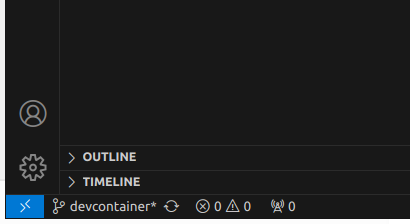
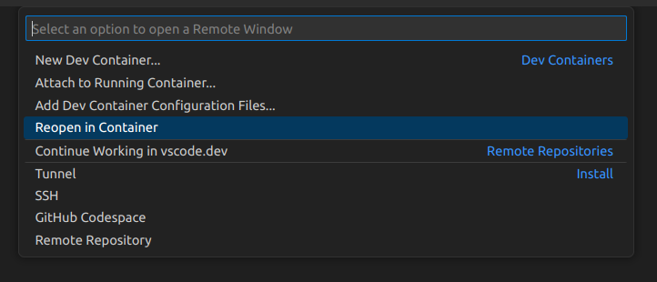
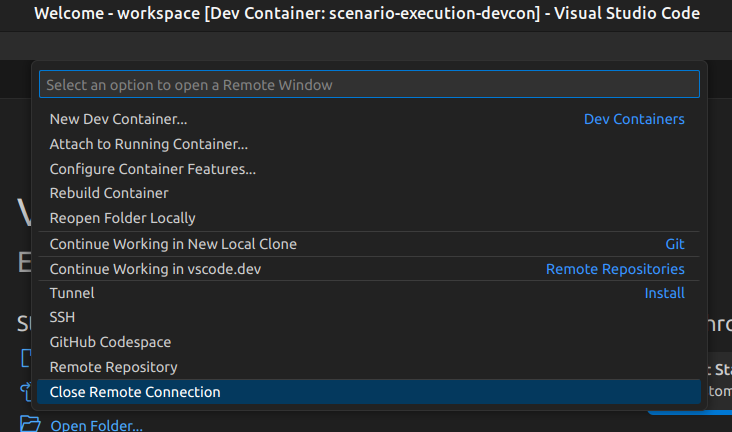
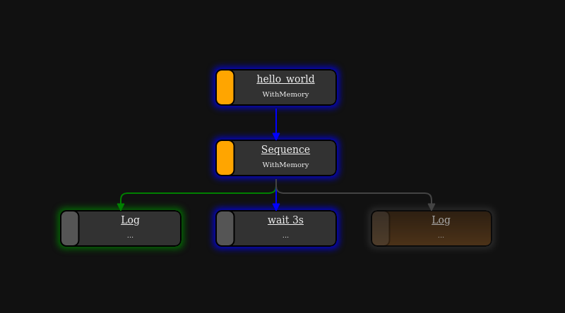

How to run
==========

.. _runtime_parameters:

Runtime Parameters
------------------

.. list-table:: 
   :header-rows: 1
   :class: tight-table   
   
   * - Parameter
     - Description
   * - ``-h`` ``--help``
     - show help message
   * - ``--bt-log``
     - Record behavior status over time to ``<output-dir>/behaviors.jsonl``. Requires ``--output-dir``. See `Behavior tree status log`_ for the file format.
   * - ``--tick-log``
     - Record how fast the tree actually ticked, and how long each behavior's calls took, to ``<output-dir>/tick_timing.csv`` and ``<output-dir>/action_timing.csv``. Requires ``--output-dir``. See `Tick and action timing`_ for the file format.
   * - ``-d`` ``--debug``
     - (For debugging) print internal debugging output
   * - ``--dot``
     - Write dot files of resulting py-tree (``<scenario-name>.[dot|png|svg]``). Writes files into current directory if no ``output-dir`` is given.
   * - ``-l`` ``--log-model``
     - (For debugging) Produce tree output of parsed scenario
   * - ``-n`` ``--dry-run``
     - Parse and resolve scenario, but do not execute
   * - ``-o OUTPUT_DIR`` ``--output-dir OUTPUT_DIR``
     - Directory for output (e.g. test results)
   * - ``--scenario-parameter-file YAML_FILE``
     - Parameter definition used to override default scenario parameter definitions. See `Override scenario parameters`_ for details.
   * - ``--create-scenario-parameter-file-template``
     - Create a template yaml file for overriding scenario parameters. The file will be named like specified by ``--scenario-parameter-file``.
   * - ``-t`` ``--live-tree``
     - (For debugging) Show current state of py tree
   * - ``--post-run POST_RUN_COMMAND``
     - Command or script to run after scenario execution. The command will be called as ``<command> <output_dir>``. Can be specified multiple times; commands are executed in order with a timeout of 10 minutes each. Failures are logged but do not stop subsequent commands. Example: ``--post-run ./post.sh --post-run ./cleanup.sh``
   * - ``-s STEP_DURATION`` ``--step-duration STEP_DURATION``
     - Duration in seconds between behavior tree ticks (default: ``0.1``); ticks are paced to it, and a tick that runs longer is reported. With a step-based ``--simulation`` the simulation's ``dt`` governs the tick period instead. See `Tick and action timing`_ for recording whether the rate was actually held.
   * - ``--simulation MODULE:CLASS``
     - Step-based simulation interface to use. The value must be in ``module.path:ClassName`` format, where the class implements :class:`SimulationInterface <scenario_execution.SimulationInterface>` and is instantiated with no arguments. See `Step-based simulation`_ for details.
   * - ``--snapshot-period SECONDS``
     - Only with ``scenario_execution_ros``. How often to publish the behavior tree state on ``/scenario_execution/snapshots``. By default a snapshot is published only when a behavior's status changes. To record tree progress to a file instead, see `Behavior tree status log`_.
   * - ``--output-result-per-scenario``
     - When more than one scenario is executed (multiple ``scenario`` declarations in the ``.osc`` file, or multiple YAML documents in ``--scenario-parameter-file``), write a separate ``test.xml`` inside each scenario's output subdirectory instead of a single combined ``<output-dir>/test.xml``. Has no effect when only one scenario is executed. See `Per-scenario output directories`_ for details.

Run locally with ROS2
---------------------

First, build the packages:

.. code-block:: bash

   colcon build --packages-up-to scenario_execution_gazebo
   source install/setup.bash

To run an osc-file with ROS2:

.. code-block:: bash

   ros2 run scenario_execution_ros scenario_execution_ros $(PATH_TO_SCENARIO_FILE)

To log the current state of the behavior tree during execution, add the ``-t`` flag as an argument and run it again:

.. code-block:: bash

   ros2 run scenario_execution_ros scenario_execution_ros $(PATH_TO_SCENARIO_FILE) -t

Additional parameters are describe in section :ref:`runtime_parameters`.

Run as standalone Python package without ROS2
---------------------------------------------

After installing :repo_link:`scenario_execution` using pip (see :ref:`install_with_pip`), you can execute a scenario with the following command

.. code-block:: bash

   scenario_execution $(PATH_TO_SCENARIO_FILE)

To log the current state of the behavior tree during execution, add the ``-t`` flag as an argument and run it again:

.. code-block:: bash

   scenario_execution $(PATH_TO_SCENARIO_FILE) -t

Additional parameters are describe in section :ref:`runtime_parameters`.

Run with Development Container inside Visual Studio Code
--------------------------------------------------------

Prerequisites
^^^^^^^^^^^^^

If not already installed, install the docker engine on your system according to the `installation instructions <https://docs.docker.com/engine/install/>`_ or, if you need GPU support, follow the `nvidia installation instructions <https://docs.nvidia.com/datacenter/cloud-native/container-toolkit/install-guide.html>`_.

Make sure you follow the `post installation steps <https://docs.docker.com/engine/install/linux-postinstall/>`_.

To make sure, that the docker daemon is properly set up, run

.. code-block:: bash

   docker run hello-world

Make sure you have installed the necessary `Visual Studio Code <https://code.visualstudio.com/>`_ extensions, namely the `docker extension <https://code.visualstudio.com/docs/containers/overview>`_ as well as the `Dev Container <https://marketplace.visualstudio.com/items?itemName=ms-vscode-remote.remote-containers>`_ extension.

Open Scenario Execution in Development Container
^^^^^^^^^^^^^^^^^^^^^^^^^^^^^^^^^^^^^^^^^^^^^^^^

First, build the packages:

.. code-block:: bash

   colcon build

Now, open the root folder of the `scenario execution repository <https://github.com/cps-test-lab/scenario-execution>`_ in Visual Studio Code by running 

.. code-block:: bash

   code /path/to/scenario_execution

in a terminal.
Make sure, that your ``ROS_DOMAIN_ID`` is properly set in the terminal you start Visual Studio Code from.
Then, click the blue item in the lower left corner

Afterwards, select "Reopen in Container " in the Selection Window inside Visual Studio Code

Now Visual Studio Code should build the development container and open your current working directory inside the container after it successfully built the image.
If you now open a terminal inside Visual Studio Code, you can run and test your development safely inside the development container by running any of the :repo_link:`examples` (see :ref:`tutorials` for further details).

Once you are done, you can cancel the remote connection, by again clicking on the blue item in the lower left corner and select "Close Remote Connection"

Visualize Scenario with PyTrees ROS Viewer
------------------------------------------

Before getting started, ensure that the PyQt5 version 5.14 Python library is installed. You can check PyQt5 version using the following command:

.. code-block:: bash

   pip freeze | grep -i pyqt

If any PyQt5 libraries are detected, it's recommended to uninstall them to avoid conflicts:

.. code-block:: bash

   pip3 uninstall PyQt5 PyQt5-Qt5 PyQt5-sip PyQtWebEngine PyQtWebEngine-Qt5

Additionally, if the default PyQtWebEngine is present, remove it using:

.. code-block:: bash

   sudo apt remove python3-pyqt5.qtwebengine

Next, install PyQt and PyQtWebEngine version 5.14:

.. code-block:: bash

   pip install PyQt5==5.14
   pip install PyQtWebEngine==5.14

Once PyQt is set up, clone the ``py_trees_ros_viewer`` repository:

.. code-block:: bash

   git clone git@github.com:splintered-reality/py_trees_ros_viewer.git

After cloning, build the package using ``colcon build`` and source the workspace.

Now, to open the viewer, execute the following command:

.. code-block:: bash

   py-trees-tree-viewer --no-sandbox

Finally, in a separate terminal, run the scenario file to visualize the behavior tree.

Example:

.. code-block:: bash

      ros2 run scenario_execution_ros scenario_execution_ros =examples/example_scenario/hello_world.osc

Please note that this method has been tested on Ubuntu 22.04. If you are using any other distribution, please ensure that 
PyQtEngine works on your machine and render web pages correctly.

Scenario Coverage
-----------------
The ``scenario_execution_coverage`` package provides the ability to run variations of a scenario from a single scenario definition. It offers a fast and efficient method to test scenario with different attribute values, streamlining the development and testing process.

Below are the steps to run a scenario using ``scenario_execution_coverage``..

First, build the packages:

.. code-block:: bash

   colcon build --packages-up-to scenario_execution_coverage
   source install/setup.bash

Then, generate the scenario files for each variation of scenario  using the ``scenario_variation`` executable, you can pass your own custom scenario as an input. For this exercise, we will use a scenario present in  :repo_link:`examples/example_scenario_variation/`.

.. code-block:: bash

   scenario_variation examples/example_scenario_variation/example_scenario_variation.osc

This will save scenario variation files with the ``.sce`` extension in the ``out`` folder within the current working directory.

To execute the generated scenario variations, run the ``scenario_batch_execution`` executable. This command will process all scenarios files present in the ``out`` folder and execute them sequentially.

.. code-block:: bash

   scenario_batch_execution -i out -o scenario_output -- ros2 run scenario_execution_ros scenario_execution_ros {SCENARIO} --output-dir {OUTPUT_DIR}

above command requires three arguments.

    - ``-i``: directory where the scenario files ``.sce`` are stored
    - ``-o``: directory where the output ``log`` and ``xml`` files will be saved (for each scenario file within a separate folder)
    - ``-- ros2 run scenario_execution_ros scenario_execution_ros {SCENARIO} --output-dir {OUTPUT_DIR}``: launch command to launch scenarios

.. note::
   ``scenario_batch_execution`` can be used for any scenario-files, not only those generated by ``scenario_variation``.

The return code of ``scenario_batch_execution`` is ``0`` if all tested scenarios succeeded. The output can be found within the specified output-folder:
 
.. code-block:: bash

   <output_folder>/
      text.xml        # overall test result (summary of all tested scenarios)
      <scenario1>/    # directory for scenario
         test.xml     # test result of scenario
         log.txt      # log output of scenario execution
         ...          # other files generated by scenario execution run (e.g. rosbag)

         
.. note::
   ``scenario_batch_execution`` creates a junit xml compatible file that can easily be integrated into a CI pipeline. An example can be found here: :repo_link:`.github/workflows/test_build.yml`

.. _multiple_scenarios_per_file:

Multiple scenarios per file
---------------------------

A single ``.osc`` file can contain any number of ``scenario`` declarations.
Scenarios are executed **sequentially** in the order they appear in the file.

.. code-block::

   scenario first_scenario:
       object_goal_pos: position_2d = position_2d(x: 0.6m, y: 0.6m)
       do serial:
           wait_for_simulation_end()

   scenario second_scenario:
       object_goal_pos: position_2d = position_2d(x: 0.3m, y: 0.6m)
       do serial:
           wait_for_simulation_end()

When ``--simulation`` is used the simulation environment is kept alive across
scenarios: ``setup()`` and ``shutdown()`` are called once for the whole file,
while ``reset()`` (together with a clock reset) is called before each
individual scenario.  This avoids the overhead of restarting the physics
engine between runs.

Each scenario result appears as a separate ``<testcase>`` in ``test.xml``.

.. _override_scenario_parameters:

Override scenario parameters
----------------------------

To override scenario parameters, specify the required parameters within a yaml file and use the command-line parameter ``--scenario-parameter-file``.

Let's look at the following example scenario ``my_scenario.osc`` with the parameter ``my_base_param`` and ``my_struct_param``.

.. code-block::

    import osc.helpers

    scenario my_scenario:
        my_base_param: string = "default value"
        my_struct_param: position_3d
        do serial:
            log(my_base_param)
            log(my_struct_param)

To override the parameter, the following yaml file ``overrides.yaml`` can be used.

.. code-block:: yaml

   my_scenario:
     my_base_param: "my_val"
     my_struct_param:
       x: 1.0
       y: 2.0
       z: 0.0

The following command executes the scenario with the defined override.

.. code-block:: bash

   ros2 run scenario_execution_ros scenario_execution_ros --scenario-parameter-file overrides.yaml my_scenario.osc

If physical literals get overridden, the values are expected in SI base units: For example specify value in meter (e.g. ``42.0``) for ``length``; specify value in seconds for ``time``.

An initial override template file can be created using the command-line parameter ``--create-scenario-parameter-file-template``. This will create a yaml file named by ``--scenario-parameter-file`` in the current working directory.

**Multi-document YAML — cross-product runs**

A ``--scenario-parameter-file`` can contain multiple YAML documents separated
by ``---``.  Each document is treated as an independent set of overrides
applied to all scenarios in the ``.osc`` file, producing
``N scenarios × M documents`` total runs.

.. code-block:: yaml

   # document 0
   first_scenario:
     object_goal_pos:
       x: 0.3
       y: 0.6
   second_scenario:
     object_goal_pos:
       x: 0.6
       y: 0.3
   ---
   # document 1
   first_scenario:
     object_goal_pos:
       x: 0.1
       y: 0.6
   second_scenario:
     object_goal_pos:
       x: 0.6
       y: 0.1

With 2 scenarios and 2 override documents this yields 4 runs:

.. list-table::
   :header-rows: 1

   * - Scenario name
     - Override document
   * - ``first_scenario-0``
     - document 0
   * - ``second_scenario-0``
     - document 0
   * - ``first_scenario-1``
     - document 1
   * - ``second_scenario-1``
     - document 1

The ``-<index>`` suffix is appended automatically when more than one document
is present; with a single document names stay as defined in the ``.osc`` file.
All results are written as separate ``<testcase>`` entries in ``test.xml``.

.. _behavior_tree_status_log:

Behavior tree status log
------------------------

``--bt-log`` records how the behavior tree progressed over time to
``<output-dir>/behaviors.jsonl``. It works the same with and without ROS 2 and needs no
middleware. ``--output-dir`` is required. How it is implemented is described under
:ref:`behavior_tree_status_log_internals`.

The file is `JSON Lines <https://jsonlines.org>`__ — one JSON object per line, each complete
in itself, so reading it is one ``json.loads`` per line with no state to carry and no join:

.. code-block:: json

   {"format":"behavior_tree_log","version":1,"scenario":"demo","scenario_file":"/scenarios/demo.osc","scenario_sha256":"e175a753…","tick_period":0.1,"clock":"SimulationClock","py_trees":"2.4.0","started_at":"2026-08-06T09:14:22Z"}
   {"timestamp":0.0,"behavior_id":"0f2b1d8c-…","parent_id":null,"child_index":null,"behavior_name":"demo","class_name":"py_trees.composites.Sequence","type":"SEQUENCE","additional_detail":"","status":"INVALID","feedback_message":"","is_active":false,"tip_id":null,"osc_file":"/scenarios/demo.osc","osc_line":3,"osc_column":0}
   {"timestamp":0.1,"behavior_id":"0f2b1d8c-…","parent_id":null,"child_index":null,"behavior_name":"demo","class_name":"py_trees.composites.Sequence","type":"SEQUENCE","additional_detail":"","status":"RUNNING","feedback_message":"","is_active":true,"tip_id":"e5182a6f-…","osc_file":"/scenarios/demo.osc","osc_line":3,"osc_column":0}

**Line 1** is the metadata record, recognizable by its ``format`` key: which scenario file was
run and its SHA-256, the tick period, which clock ``timestamp`` came from, and the py_trees
version.

**The following lines** describe one behavior each. Before the first tick, every node in the
tree is written once at ``timestamp`` 0 with status ``INVALID``; afterwards a line is added
whenever a behavior's **status** changes. ``feedback_message`` is captured at that moment but
does not itself trigger a line.

Because the initial snapshot covers the whole tree, the structure and the state at any point
in time can be reconstructed from the file alone, including branches that never executed.

.. list-table::
   :header-rows: 1
   :class: tight-table

   * - Field
     - Description
   * - ``timestamp``
     - Seconds since the scenario started. Simulated time when a clock is available (``--simulation``, or ROS with ``use_sim_time``), otherwise monotonic time. The metadata record's ``clock`` field says which.
   * - ``behavior_id``, ``parent_id``
     - py_trees' own UUIDs. ``parent_id`` is ``null`` for the root.
   * - ``child_index``
     - Position among the parent's children, ``null`` for the root. Needed to restore the order of a sequence's children, which ``parent_id`` alone does not give.
   * - ``behavior_name``, ``class_name``
     - Name given on construction, and the fully qualified class.
   * - ``type``
     - ``SEQUENCE``, ``SELECTOR``, ``PARALLEL``, ``DECORATOR`` or ``BEHAVIOUR``.
   * - ``additional_detail``
     - Extra information about the node, e.g. a parallel's policy.
   * - ``status``
     - ``INVALID``, ``RUNNING``, ``SUCCESS`` or ``FAILURE``.
   * - ``feedback_message``
     - The behavior's feedback message at that moment.
   * - ``is_active``
     - Whether the behavior was traversed by the tick that produced this record.
   * - ``tip_id``
     - The behavior that determined this subtree's status (py_trees' ``tip()``), so a failing root points straight at the action responsible. ``null`` on a leaf.
   * - ``osc_file``, ``osc_line``, ``osc_column``
     - Where the behavior came from in the scenario source. The file is per record because an imported ``.osc`` keeps its own name. Line is 1-based, column 0-based. ``null`` for a behavior with no source element, e.g. a subtree an action builds internally.
   * - ``removed``
     - Present and ``true`` only when a subtree was pruned at runtime; the record then carries just ``timestamp`` and ``behavior_id``.

Records are flushed as they are written, so a scenario that is aborted or times out still
leaves a readable file up to that point.

.. _tick_and_action_timing:

Tick and action timing
----------------------

``--tick-log`` records how fast the behavior tree actually ticked, and where the time inside a
tick went. It works the same with and without ROS 2 and needs no middleware. ``--output-dir``
is required. It is independent of ``--bt-log``: either can be used alone.

Two questions, in order. **Was the tick rate held?** ``tick_timing.csv`` has one row per tick,
with the interval since the previous tick and the period that was configured, so
``interval_s / period_s`` is the achieved-against-intended ratio — dimensionless, and therefore
comparable between a fast and a slow machine. **If it was not, where did the time go?**
``action_timing.csv`` has one row per timed call, so a long tick can be attributed to the
behavior that spent it. That second file is just as useful on its own, to find out which action
in a scenario is slow.

Only timing is recorded; no processor or memory usage is measured.

.. code-block:: text

   tick,wall_ts,timestamp,interval_s,duration_s,period_s,driver
   87,1756450010.411000,10.408000,0.107000,0.023000,0.100000,ros_timer
   88,1756450010.512000,10.509000,0.101000,0.417000,0.100000,ros_timer
   89,1756450010.933000,10.930000,0.421000,0.004000,0.100000,ros_timer

.. list-table::
   :header-rows: 1
   :class: tight-table

   * - Field
     - Description
   * - ``tick``
     - Tick number, counting from 1. Joins the two files.
   * - ``wall_ts``
     - Seconds since the epoch, advanced by a monotonic clock so that a step of the system clock during a run cannot make the series go backwards.
   * - ``timestamp``
     - Seconds since the scenario started, with exactly the meaning it has in ``behaviors.jsonl``: simulated time when a clock is available, otherwise monotonic time.
   * - ``interval_s``
     - Seconds since the previous tick started. Empty on the first tick, where there is no previous tick to measure against.
   * - ``duration_s``
     - Seconds spent inside this tick.
   * - ``period_s``
     - The configured tick period this tick was aiming for. Carried on every row so a ratio needs no lookup elsewhere.
   * - ``driver``
     - What ticked the tree: ``wall_loop`` (the plain runner), ``ros_timer`` (ROS), or ``sim_step`` (a step-based ``--simulation``). With ``sim_step`` the loop is unpaced, so ``interval_s`` says how fast the machine ran and not whether a rate was held.

.. code-block:: text

   tick,wall_ts,timestamp,behavior_id,behavior_name,class_name,phase,duration_s,status
   87,1756450010.411000,10.408000,c204…,spawn_walker,…GazeboSpawnActor,execute,0.018000,INVALID
   88,1756450010.512000,10.509000,c204…,spawn_walker,…GazeboSpawnActor,update,0.414100,RUNNING
   88,1756450010.512000,10.509000,a17e…,drive_to_kitchen,…NavigateToPose,update,0.002100,RUNNING

.. list-table::
   :header-rows: 1
   :class: tight-table

   * - Field
     - Description
   * - ``tick``
     - The tick this call belongs to. Empty for a call made before the first tick, which is where bring-up ``setup`` happens.
   * - ``wall_ts``, ``timestamp``
     - The moment of the tick this call belongs to, on the same two clocks as ``tick_timing.csv``.
   * - ``behavior_id``, ``behavior_name``, ``class_name``
     - Identity, spelled exactly as ``behaviors.jsonl`` spells it, so the files can be joined on ``behavior_id`` without translating either.
   * - ``phase``
     - ``setup`` (once per behavior, at bring-up), ``execute`` (once per activation: for an action, resolving its arguments and running its ``execute()``), or ``update`` (once per tick the behavior was ticked). Separate so a one-off cost is never read as a per-tick one.
   * - ``duration_s``
     - Seconds spent in this call.
   * - ``status``
     - The behavior's status after the call.

Every leaf of the tree is recorded, not only the actions from the action libraries — a
``wait elapsed()`` and an ``emit`` are behaviors too, and leaving them out would attribute their
time to nothing. Composites are left out: they route ticks rather than do work.

Reading the two files together, a tick whose ``duration_s`` is large with ``action_timing`` rows
summing to most of it is time spent *inside* the tick, by a behavior these name. A large
``interval_s`` where the previous tick was short and no rows account for the gap is time that
passed *between* ticks, with nothing running.

A summary is logged at the end of the run, and the same summary can be printed later from the
files alone::

   python -m scenario_execution.tick_report <output-dir>

If ``behaviors.jsonl`` is present it is used to name the ``.osc`` file and line a slow behavior
came from; without it everything else still works.

Rows are buffered and written about once per second, so a scenario that is aborted keeps
everything up to the last flush.

.. _per_scenario_output_directories:

Per-scenario output directories
--------------------------------

When more than one scenario is executed (multiple ``scenario`` blocks in the ``.osc`` file,
or multiple YAML documents in ``--scenario-parameter-file``), each scenario automatically
gets its own **subdirectory** inside ``--output-dir``.  The subdirectory is named after the
scenario (including any ``-<idx>`` suffix for multi-document runs).

.. code-block::

   <output-dir>/
      first_scenario/          # output for scenario "first_scenario"
      second_scenario/         # output for scenario "second_scenario"
      test.xml            # combined results (default)

The subdirectory name can be overridden per scenario via the special ``_output_dir`` key
inside the ``--scenario-parameter-file``.  Relative values are resolved relative to
``--output-dir``; absolute values are used as-is (and no existing files are removed).

.. code-block:: yaml

   test_scenario:
     _output_dir: my_custom_dir      # → <output-dir>/my_custom_dir/
     object_goal_pos:
       x: 0.3
       y: 0.6
   test_scenario2:
     _output_dir: /tmp/test2_out     # absolute path, used directly
     object_goal_pos:
       x: 0.6
       y: 0.3

.. note::
   Relative ``_output_dir`` paths must not start with ``..`` (i.e. they must not
   escape the root ``--output-dir``).

**Per-scenario test.xml**

By default a single combined ``<output-dir>/test.xml`` is written.
Pass ``--output-result-per-scenario`` to write one ``test.xml`` per scenario
subdirectory instead:

.. code-block::

   <output-dir>/
      first_scenario/
         test.xml         # result of "first_scenario" only
      second_scenario/
         test.xml         # result of "second_scenario" only
                          # no combined test.xml at root level

.. _step_based_simulation:

Step-based simulation
---------------------

Scenario Execution supports running scenarios against step-based simulators (e.g. MuJoCo, PyBullet, custom hardware-in-the-loop).

In step-based mode the framework drives the loop: it calls ``simulation.step()`` once per behavior-tree tick, advances a :class:`SimulationClock <scenario_execution.SimulationClock>`, and then ticks the behavior tree. There is no ``time.sleep()`` — the scenario runs as fast as the simulator allows.

**Implementing a SimulationInterface**

Create a class that inherits from :class:`SimulationInterface <scenario_execution.SimulationInterface>` and implement its abstract methods:

.. code-block:: python

   # my_pkg/my_sim.py
   from scenario_execution import SimulationInterface

   class MySimulation(SimulationInterface):

       @property
       def dt(self) -> float:
           """Duration of one simulation step in seconds."""
           return 0.002  # 500 Hz

       def setup(self, **kwargs) -> None:
           """Called once before any scenario runs. Load worlds, connect to
           simulator processes, allocate resources here."""
           import mujoco
           self._model = mujoco.MjModel.from_xml_path("robot.xml")
           self._data = mujoco.MjData(self._model)

       def reset(self, object_start_x=0.0, object_start_y=0.0) -> None:
           """Called before each scenario. OSC parameters with matching names
           are injected automatically as keyword arguments."""
           import mujoco
           mujoco.mj_resetData(self._model, self._data)
           self._data.qpos[:2] = [object_start_x, object_start_y]

       def step(self) -> None:
           """Advance the simulation by one timestep (dt seconds).
           Must be non-blocking."""
           import mujoco
           mujoco.mj_step(self._model, self._data)

       def shutdown(self) -> None:
           """Called once after all scenarios complete."""
           self._model = None
           self._data = None

**Passing scenario parameters to the simulation**

Declare the OSC parameters you need directly as arguments on your ``reset()``
override. The framework matches argument names to OSC parameter names and
injects values automatically:

.. code-block::

   scenario my_scenario:
       object_start_x: float = 0.0   # metres
       object_start_y: float = 0.0
       object_mass:    float = 1.0   # kg (not consumed by reset)

   action my_scenario.run():
       do serial:
           wait elapsed(5.0s)

.. code-block:: python

   def reset(self, object_start_x, object_start_y, gravity=9.81):
       # object_start_x / object_start_y injected from OSC
       # gravity uses its Python default because it is not in the scenario
       ...

Required arguments (no default) that are absent from the scenario file cause
a clear error before ``reset()`` is ever called.  Optional arguments (with
defaults) are passed when the scenario declares them, otherwise the default
is used.  Struct parameters are passed as nested dictionaries.

If a ``--scenario-parameter-file`` is supplied the overridden values are
applied before ``reset()`` is called.

The ``SimulationInterface`` lifecycle is aligned with the
`ros-simulation/simulation_interfaces <https://github.com/ros-simulation/simulation_interfaces>`_ standard:

.. list-table::
   :header-rows: 1

   * - ``SimulationInterface`` method
     - ``simulation_interfaces`` equivalent
   * - ``setup()``
     - Load world + simulator launch
   * - ``reset()``
     - ``ResetSimulation`` service (``SCOPE_ALL``)
   * - ``step()``
     - ``StepSimulation(steps=1)`` service
   * - ``shutdown()``
     - ``SetSimulationState(STATE_QUITTING)``

**Running a scenario with a simulation**

Pass the ``--simulation`` flag with the fully-qualified class path:

.. code-block:: bash

   scenario_execution --simulation my_pkg.my_sim:MySimulation my_scenario.osc

**Accessing the simulation from behaviors**

Behaviors receive the simulation object via ``kwargs['simulation']`` in their
``setup()`` method — the same pattern as ROS behaviors using ``kwargs['node']``:

.. code-block:: python

   from scenario_execution.actions.base_action import BaseAction
   import py_trees

   class ReadSensor(BaseAction):

       def setup(self, **kwargs):
           self.sim = kwargs['simulation']

       def update(self):
           obs = self.sim.get_observation()
           if obs['done']:
               return py_trees.common.Status.SUCCESS
           return py_trees.common.Status.RUNNING

**Time-based waits with simulation clock**

The ``wait elapsed()`` directive and ``timeout()`` modifier automatically use
the :class:`SimulationClock <scenario_execution.SimulationClock>` when a
simulation is active. No changes to the OSC scenario file are needed:

.. code-block::

   scenario test:
       do serial:
           wait elapsed(1s)   # counts 1 / dt simulation steps, not wall-clock seconds

Without a simulation interface the clock falls back to system wall-clock time,
so existing scenarios continue to work unchanged.

**Step-based simulation with the ROS runner**

``--simulation`` works with both runners:

* ``scenario_execution`` (non-ROS): the simulation drives the loop exclusively
  (``run_with_simulation``); there is no ``rclpy``, so ROS behaviors are unavailable.
* ``scenario_execution_ros`` (ROS): the ROS spin loop additionally ticks
  ``simulation.step()``, so a step-based simulation runs **alongside** the ROS
  behaviors that drive it. This lets a scenario bring up and drive a ROS stack
  while the simulation advances time. A simulation that publishes ``/clock``
  becomes the time source for every node, including this one, and stepping is
  paced to real time (the pace can be removed for faster-than-real-time runs).

  With the ROS runner, ``setup()``/``reset()``/``step()``/``shutdown()`` are
  called **per scenario** (each scenario runs on its own ROS node), rather than
  ``setup``/``shutdown`` once for the whole file as with the non-ROS runner.

.. _ros_simulated_time_usage:

Running a scenario against simulated time
-----------------------------------------

With the ROS runner, ``use_sim_time`` makes the scenario's own durations simulated seconds. It is
off by default, so a scenario that does not ask for it counts host seconds exactly as before.

.. code-block:: bash

   ros2 launch scenario_execution_ros scenario_launch.py scenario:=example.osc use_sim_time:=True

   # or, running the executable directly
   ros2 run scenario_execution_ros scenario_execution_ros example.osc --ros-args -p use_sim_time:=true

Under it the behavior tree ticks on ``/clock`` as well, so the same scenario produces the same ticks
at the same points however fast the host happens to be. This is what a duration means in each case:

.. list-table::
   :widths: 40 60
   :header-rows: 1
   :class: tight-table

   * - What
     - Which clock
   * - ``wait elapsed()``, ``until elapsed()``, ``timeout()``
     - The scenario's. Simulated seconds under ``use_sim_time``.
   * - ``action_call(cancel_after:)``
     - The scenario's.
   * - ``assert_tf_moving(timeout:)``
     - The scenario's -- it is an assertion about the robot.
   * - ``run_process``/``ros_launch``/``ros_run`` ``shutdown_timeout``
     - Host. It bounds an OS process, and it runs during teardown.
   * - ``assert_realtime_factor()``, ``assert_topic_latency()``
     - Host. Both measure the host against something else, which is the point of them.
   * - ``bag_record(use_sim_time:)``
     - Sets ``--use-sim-time`` on ``ros2 bag record``. It follows this node, and the parameter
       forces it on regardless.

Something has to publish ``/clock``. If nothing does, the scenario fails at startup rather than
measuring every duration from zero:

.. code-block::

   use_sim_time is set but /clock did not advance within 30.0s of host time.
   Every duration in the scenario would be measured from zero.

And because the tree ticks on ``/clock``, a simulator that stops or is reset mid-run stops the tree.
That is reported rather than waited out:

.. code-block::

   /clock did not advance for 30.1s of host time. The behaviour tree ticks on ROS time
   and has stopped ticking.

   /clock stepped back by 5.000s: the simulation was reset underneath the running scenario.
